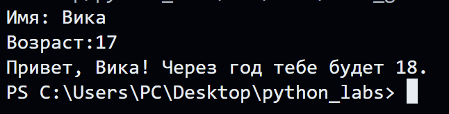
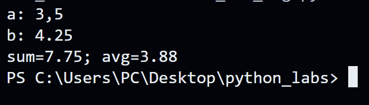
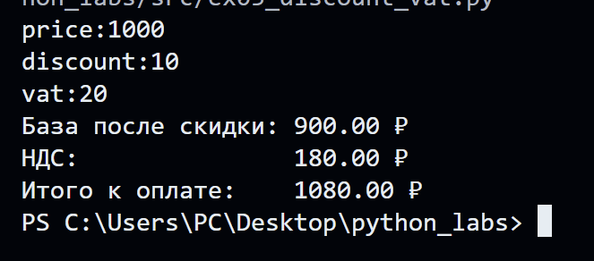
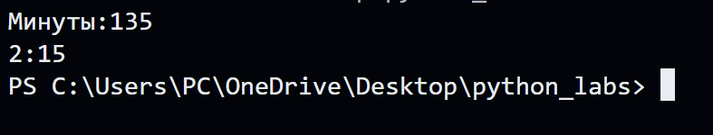
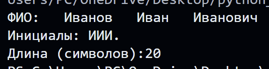

# Лабораторная работа 1
## Задание 1
### name=input('Имя:')
### age=int(input("Возраст:"))
### print(f'Привет,{name}! Через год тебе будет {age+1}.')

## Задание 2
### a=float(input('a:').replace(',','.'))
### b=float(input('b:').replace(',','.'))
### print(f'sum={a+b}; avg={((a+b)/2):.2f}')

## Задание 3
### print(f'База после скидки: {base:.2f} ₽')
### print(f'НДС:         {vat_amount:.2f} ₽')
### print(f'Итого к оплате:    {total:.2f} ₽')

## Задание 4
### minute=int(input('Минуты:'))
### print(f'{minute//60}:{(minute%60):02d}')

## Задание 5
### print(f'Инициалы: {init}.') 
### print(f'Длина (символов):{cnt+2}')

