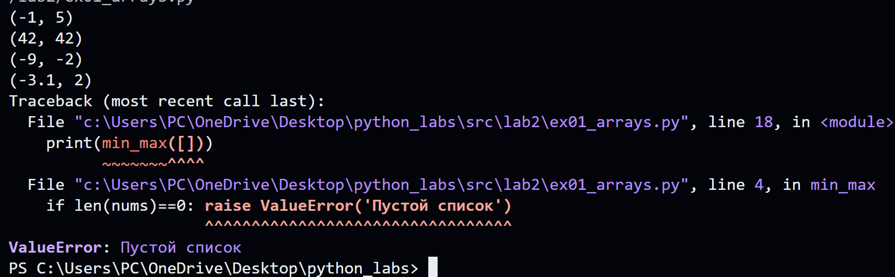
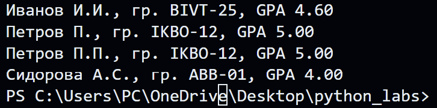

# ЛР2 — Коллекции и матрицы (list/tuple/set/dict)
## Задание 1 — arrays.py
## Min_Max
```python
def min_max(nums: list[float | int]) -> tuple[float | int, float | int]:
    if len(nums)==0: raise ValueError('Пустой список')
    mi=nums[0]
    ma=nums[0]
    for i in nums:
        if i<mi:
            mi=i
        if i>ma:
            ma=i
    ans=(mi,ma)
    return ans
```
### Тест-кейсы
```python
print(min_max([3, -1, 5, 5, 0]))
print(min_max([42]))
print(min_max([-5, -2, -9]))
print(min_max([1.5, 2, 2.0, -3.1]))
print(min_max([]))
```


## Unique_sorted
```python 
def unique_sorted(nums: list[float | int]) -> list[float | int]:
    """Возвращает отсортированный список уникальных значений (по возрастанию)
    [3, 1, 2, 1, 3] → [1, 2, 3]
    """
    unikal=set(nums)
    nums=[]
    nums.extend(unikal)
    n=len(nums)
    for i in range(n-1):
        for j in range(0,n-i-1):
            if nums[j]>nums[j+1]:
                nums[j],nums[j+1]=nums[j+1],nums[j]
    return (nums)
```
### Тест-кейсы
```python
print(unique_sorted([3,3,2,1,4]))
print(unique_sorted([]))
print(unique_sorted([-1, -1, 0, 2, 2]))
print(unique_sorted([1.0, 1, 2.5, 2.5, 0]))
```


## Flatten
```python 
def flatten(mat: list[list | tuple]) -> list:
    """Расплющивает список списков/кортежей в один список по строкам (row-major)
    [[1], [], [2, 3]] → [1, 2, 3]
    """
    result=[]
    for i in mat:
        if type(i)==list or type(i)==tuple:
            result+=i
        else:
            raise TypeError('неверный тип данных')
    return result
```
### Тест-кейсы
```python
print(flatten([[1, 2], [3, 4]]))
print(flatten([[1, 2], (3, 4, 5)]))
print(flatten([[1], [], [2, 3]]))
print(flatten([[1, 2], "ab"]))
```


## Задание 2
## Transpose
```python
def transpose(mat: list[list[float | int]]) -> list[list]:
    """Поменять строки и столбцы местами в прямоугольной матрице
    [[1, 2], [3, 4]] → [[1, 3], [2, 4]]
    """
    for row in mat:
        if len(row)!=len(mat[0]):
            raise ValueError('«матрица рваная» (строки разной длины)')
    if mat==[]: return []    
    cnt_stolb=len(mat[0])
    
    ans=[]
    for j in range(cnt_stolb):
        a=[]
        for row in mat:
            a.append(row[j])
        ans.append(a)
    return ans
```
### Тест-кейсы:
```python
print(transpose([[1, 2, 3]]))
print(transpose([[1], [2], [3]]))
print(transpose([[1, 2], [3, 4]]))
print(transpose([]))
print(transpose([[1, 2], [3]]))
```


## Row_sums
```python
def row_sums(mat: list[list[float | int]]) -> list[float]:
    """Сумма по каждой строке. Требуется прямоугольность 
    [[1, 2, 3], [4, 5, 6]] → [6, 15]
    """
    for row in mat:
        if len(row)!=len(mat[0]):
            raise ValueError('Рваная матрица')
    ans=[]
    for row in mat:
        ans.append(sum(row))
    return ans
```
### Тест-кейсы
```python
print(row_sums([[1, 2, 3], [4, 5, 6]]))
print(row_sums([[-1, 1], [10, -10]]))
print(row_sums([[0, 0], [0, 0]]))
print(row_sums([[1, 2], [3],]))
```


## Col_sums
```python
def col_sums(mat: list[list[float | int]]) -> list[float]:
    """ Сумма по каждому столбцу. Требуется прямоугольность.
    [[1, 2, 3], [4, 5, 6]] → [5, 7, 9] """
    
    for row in mat:
        if len(row)!=len(mat[0]):
            raise ValueError('рвананя матрица')
    ans=[]
    st=len(mat[0])
    for j in range(st):
        cnt=0
        for row in mat:
            cnt+=row[j]
        ans.append(cnt)
    return ans
```
### Тест-кейс
```python
print(col_sums([[1,2,3],[4,5,6]]))
print(col_sums([[-1, 1], [10, -10]]))
print(col_sums([[0, 0], [0, 0]]))
print(col_sums([[1, 2], [3]]))
```


## Задание 3
## Format_record
```python
def format_record(rec: tuple[str, str, float]) -> str:
    """Тип записи студента как кортеж
    ("Иванов Иван Иванович", "BIVT-25", 4.6) → "Иванов И.И., гр. BIVT-25, GPA 4.60"
    """
    
    if type(rec[0])!=str or type(rec[1])!=str or type(rec[2])!=float:
        raise TypeError('Неверный тип данных')
    if rec[0]=='' or rec[1]=='':
        raise ValueError('Некорректная запись')
    
    fio,group,gpa=rec
    
    try:
        f,i,o=fio.split()
        ans1=f'{f[0].upper()+f[1:]} {i[0].upper()}.{o[0].upper()}.'
    except: 
        f,i=fio.split()
        ans1=f'{f[0].upper()+f[1:]} {i[0].upper()}.'
    ans2=group.strip()
    if 0.0<=gpa<=5.0:
        ans3=float(str(gpa).strip())
    
    return f'{ans1}, гр. {ans2}, GPA {ans3:.2f}'
```
### Тест-кейсы:
```python 
print(format_record(("Иванов Иван Иванович", "BIVT-25", 4.6)))
print(format_record(("Петров Пётр", "IKBO-12", 5.0)))
print(format_record(("Петров Пётр Петрович", "IKBO-12", 5.0)))
print(format_record(("  сидорова  анна   сергеевна ", "ABB-01", 3.999)))
```
