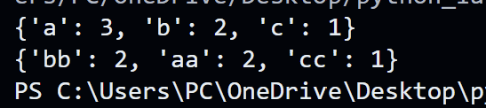
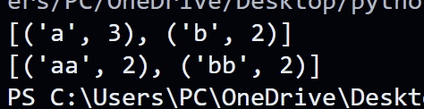
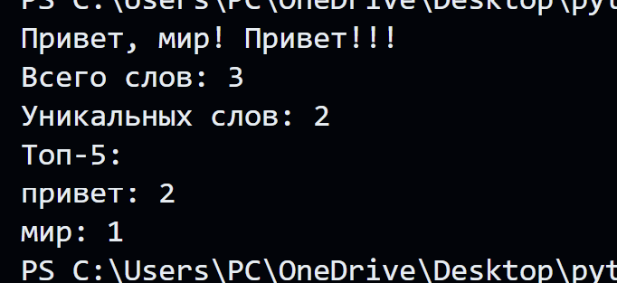

# ЛР3 — Тексты и частоты слов (словарь/множество)
## Задание A — src/lib/text.py
## `Normalize`
``` python
def normalize(text: str, *, casefold: bool = True, yo2e: bool = True) -> str:
    """Возвращает объект типа str, представляющий нормализованный текстовый эквивалент 
    исходной строки"""
    if casefold==True:
        text=(text.casefold())
    else: text=text.lower()
    
    if yo2e==True: 
        text=text.replace('ё', 'е').replace('Ё', 'Е')
    
    text=' '.join(text.split())
    
    return text
```
### Тест-кейсы:
```python
print(normalize("ПрИвЕт\nМИр\t"))
print(normalize("ёжик, Ёлка"))
print(normalize("Hello\r\nWorld"))
print(normalize("  двойные   пробелы  "))
```

###   
## `Tokenize`
```python
import re
def tokenize(text: str) -> list[str]:
    '''Функция возвращает объект типа list[str],
    элементами которого являются текстовые токены, выделенные из исходной строки.
    '''
    result=normalize(text)
    result=re.findall(r"\w+(?:-\w+)*",result)
    return result
```
### Тест-кейсы:
```python
print(tokenize("привет мир"))
print(tokenize("heLLo,world!!!"))
print(tokenize("по-настоящему круто"))
print(tokenize("2025 год"))
print(tokenize("emoji 😀 не слово"))
```


## `Count_freq`
```python
def count_freq(tokens: list[str]) -> dict[str, int]:
    """Подсчёт частоты встречаемости элементов.
    Возвращает объект типа dict[str, int]
    freq == {"a":3, "b":2, "c":1}
    """
    slovar={}
    
    for w in tokens:
        slovar[w]=slovar.get(w,0) + 1
        
    return slovar
```
### Тест-кейсы
```python
print(count_freq(["a","b","a","c","b","a"]))
print(count_freq(["bb","aa","bb","aa","cc"]))
```



## `Top_N`
```python
def top_n(freq: dict[str, int], n: int = 3) -> list[tuple[str, int]]:
    
    """Возвращает список топ-N по убыванию частоты; при равенстве — строго по алфавиту слова.
    top_n({"bb":2,"aa":2,"cc":1}, 2) == [("aa",2), ("bb",2)]"""
    
    result=sorted(freq.items(), key=lambda kv: (-kv[1], kv[0]))[:n]
    return result 
```

### Тест-кейсы
```python
print(top_n({"a":3,"b":2,"c":1},2))
print(top_n({"bb":2,"aa":2,"cc":1},2))
```



# `Задание B — src/text_stats.py` (скрипт со stdin)

```python
from src.lib.text import normalize, tokenize, count_freq, top_n

text=input()

norm_text=normalize(text)
token_text=tokenize(norm_text)
cnt_unik_words=count_freq(token_text)
top=top_n(cnt_unik_words)

print(f'Всего слов: {len(token_text)}')
print(f'Уникальных слов: {len(cnt_unik_words)}')
print('Топ-5:')
for kzh in top:
    print(f'{kzh[0]}: {kzh[1]}')
```
### Тест-кейс
```python
print('Привет, мир! Привет!!!')
```


НАПИСАТЬ ПОЯСНЕНИЕ К КАЖДОЙ ФУНКЦИИ И ДОКСТРИНГ В ТЕКСТ СТАТС!!!!!!!!!!!!!!!!!!!!!!!!!!!!!!!!!!!!!!!!!!!!!!!!!!!!!!!!!!!!!!!!!!!!!!!!111