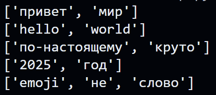

# ЛР3 — Тексты и частоты слов (словарь/множество)
## Задание A — src/lib/text.py
## Normalize
``` python
def normalize(text: str, *, casefold: bool = True, yo2e: bool = True) -> str:
    """Возвращает объект типа str, представляющий нормализованный текстовый эквивалент 
    исходной строки"""
    if casefold==True:
        text=(text.casefold())
    else: text=text.lower()
    
    if yo2e==True: 
        text=text.replace('ё', 'е').replace('Ё', 'Е')
    
    text=' '.join(text.split())
    
    return text
```
### Тест-кейсы:
```python
print(normalize("ПрИвЕт\nМИр\t"))
print(normalize("ёжик, Ёлка"))
print(normalize("Hello\r\nWorld"))
print(normalize("  двойные   пробелы  "))
```


## Tokenize
```python
import re
def tokenize(text: str) -> list[str]:
    '''Функция возвращает объект типа list[str],
    элементами которого являются текстовые токены, выделенные из исходной строки.
    '''
    result=normalize(text)
    result=re.findall(r"\w+(?:-\w+)*",result)
    return result
```
### Тест-кейсы:
```python
print(tokenize("привет мир"))
print(tokenize("heLLo,world!!!"))
print(tokenize("по-настоящему круто"))
print(tokenize("2025 год"))
print(tokenize("emoji 😀 не слово"))
```
